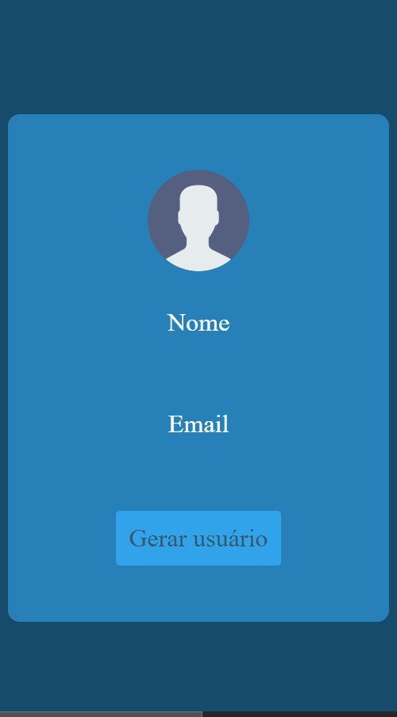

 

    

  <h3 align="center">Gerador de usuários by <a href="https://github.com/brunoandreotti">Bruno</a></h3>
  
  

     Projeto desenvolvido por <a class="credits" href="https://www.linkedin.com/in/bruno-andreotti-9384411b4/" target="_blank">Bruno Andreotti</a> como projeto de estudo.
      

  | <a href="#sobre"> Sobre </a> |    
  <a href="#tecnologias-utilizadas"> Tecnologias utilizadas </a> |     
        
     
    <h1 align="center">
    
 </h1>
  

# Sobre

O objetivo do projeto foi criar um gerador de usuários simples com a finalidade de colocar em prática os conhecimentos que adquiri até o momento sobre requisições AJAX!

# Como utilizar:

- Clique no botão 'Gerar Usuário'
- Ao clicar será gerado uma imagem, um nome e um e-mail aleatórios

# Tecnologias utilizadas:

  

---

**Desenvolvido por [Bruno Andreotti](https://www.linkedin.com/in/bruno-andreotti-9384411b4/).**
